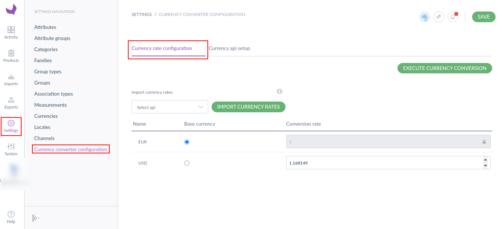
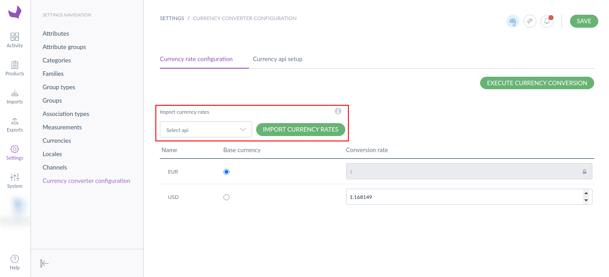
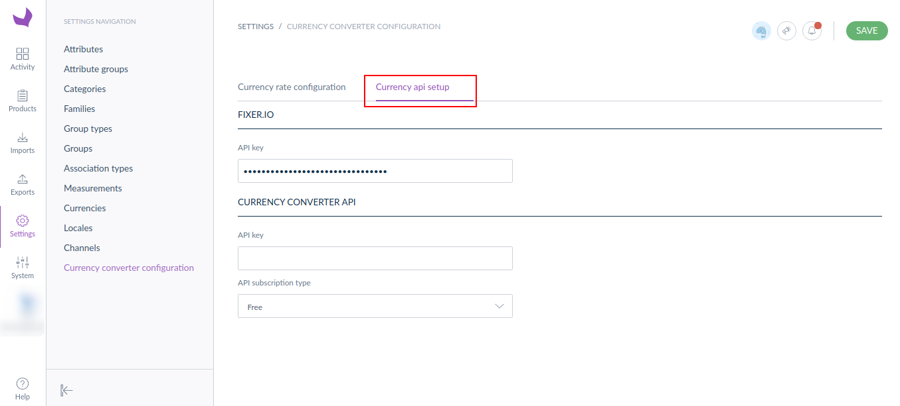
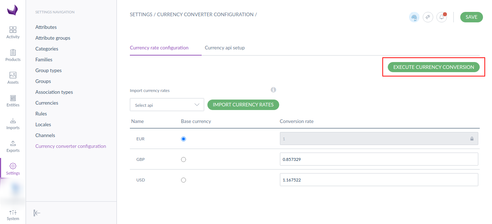

Akeneo Currency Conversion
=====================================

Akeneo Currency Conversion is a module that allows you to convert one currency price to another currency based on the currency rates and process updated prices across products.

There is an option **Currency converter configuration** inside the Akeneo Settings menu. Inside the configuration, you can set currency rates and select the base currency for currency rate conversion.

You can update the currency rates manually as well as using currency API. For fetching the currency rated from API, our extension support two currency APIs **Fixer Io(https://fixer.io/) and Currency Converter API(https://free.currencyconverterapi.com/)**. For this, you just need to get your APIs and setup in the configuration and then you can fetch the currency rates.

Installation instructions
-------------------------

* First, install the package with the following command.
```bash
composer require krishtechnolabs/akeneo-currency-rate-conversion
```
* Register the module in the config/bundles.php
``` php
KTPL\CurrencyRateConversionBundle\CurrencyRateConversionBundle::class => ['all' => true],
```
* Now that you have activated and configured the bundle, now all you need to do is import the AkeneCurrencyRateConversionBundleoTrashBundle routing files.

``` yml
# config/routes/ktpl_currency_conversion.yml
ktpl_currency_conversion:
    resource: "@CurrencyRateConversionBundle/Resources/config/routing.yml"
    prefix: /
```

* Now, run the below command from the terminal from the installation directory.

```bash
php bin/console ca:cl && php bin/console ktpl:install:currency-rate-conversion
```

How to use it
--------------
* To see how Akeneo PIM currency conversion works, the first step you need to do is set the base currency and the currency rates.
For the setup, click on the Currency converter configuration navigation in the Akeneo Settings Menu.


* Also, you can fetch the updated currency using the currency APIs



* Now, you just need to click on the EXECUTE CURRENCY CONVERSION button that's it. This process will automatically save the updated price value in the products.
